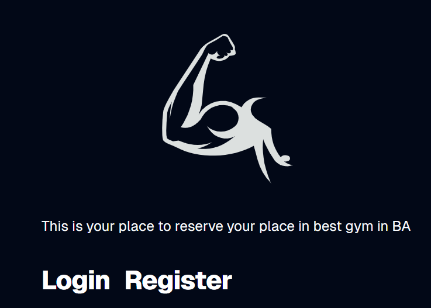
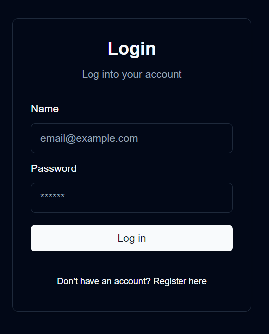
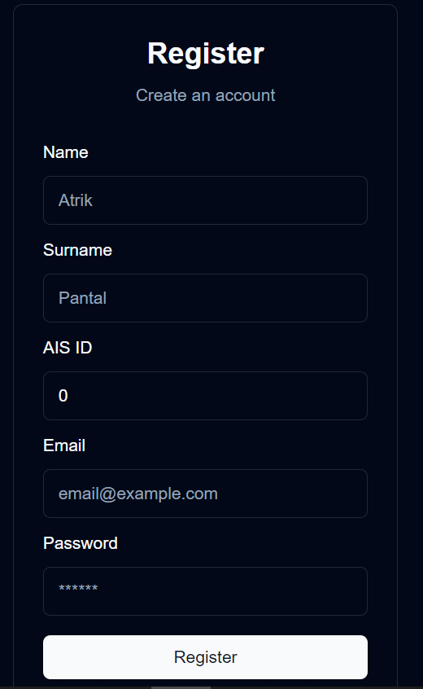
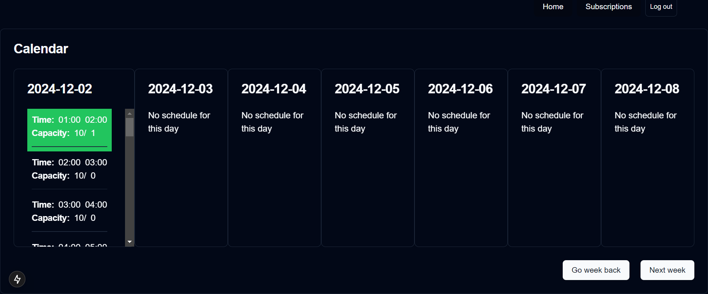
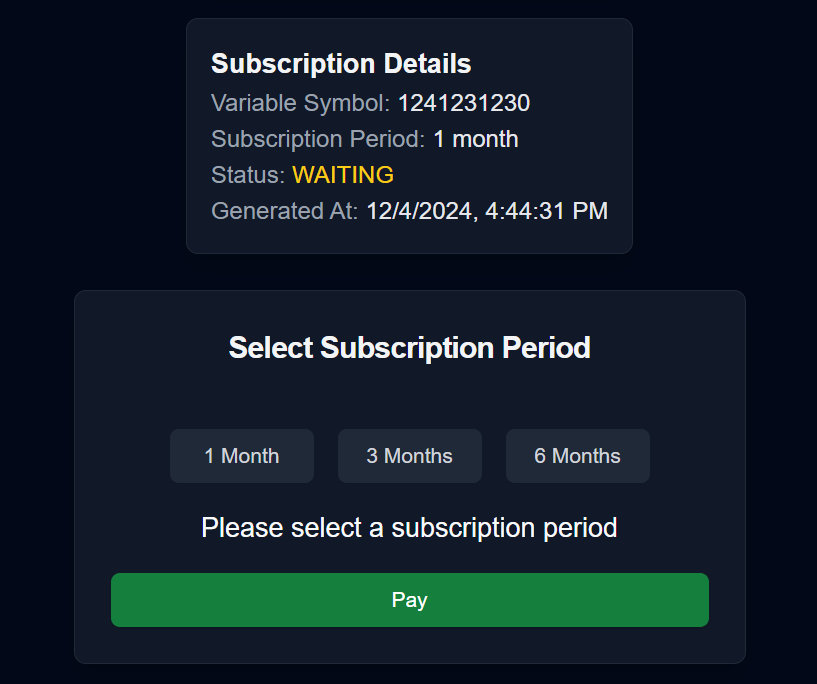
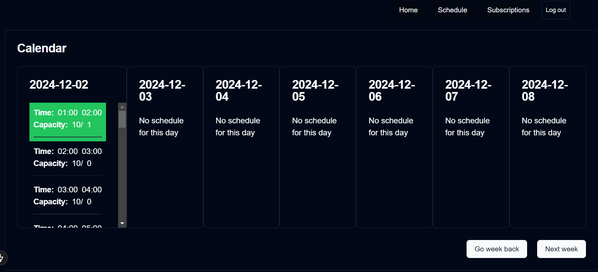
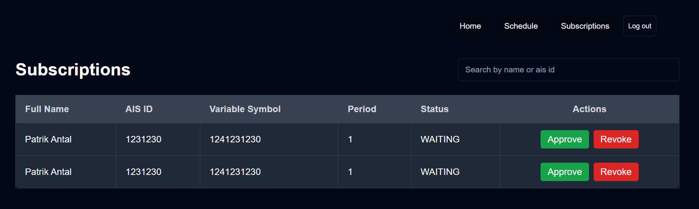
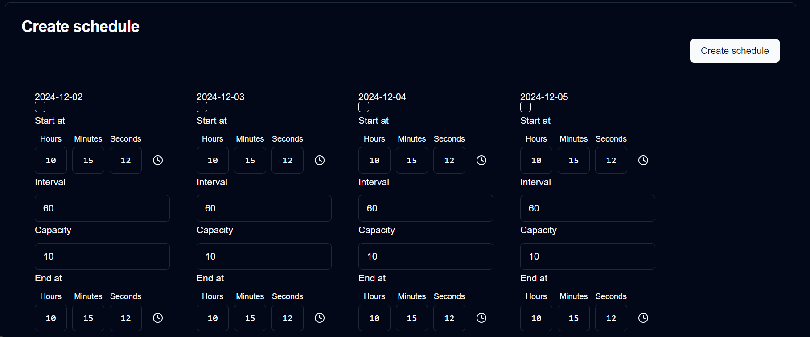

# monorepo
install pnpm https://pnpm.io/installation
```
pnpm install
```

# frontend
```
cd apps/next
pnpm run dev
```

# backend
```
cd apps/fastify-api
pnpm run dev
```
backend is running on http://localhost:3939

## DB and ORM

### when you change or add entity
```
npx mikro-orm-esm schema:drop --run
npx mikro-orm-esm schema:create --run
```
or 
```
# first check what gets generated
npx mikro-orm-esm schema:update --dump

# and when its fine, sync the schema
npx mikro-orm-esm schema:update --run
```

### Migrations 
not needed now

# DB
```
docker compose up
```

# Routes
- **/** - The home page where users can navigate to Register or Login  
  


- **/auth/login** - Login page for user authentication  
  


- **/auth/register** - Registration page for new users  
  


- **/user** - User dashboard to browse the calendar of planned schedules and join terms  
    
  


- **/user/sub** - Page for users to order a subscription

  


- **/admin** - Admin dashboard to view the calendar, terms

  


- **/admin/sub** - Admin page to review and manage pending subscriptions (approve/revoke)

  


- **/admin/createSchedule** - Admin page to plan schedules for upcoming weeks, set capacity, time intervals, and duration
  
  
