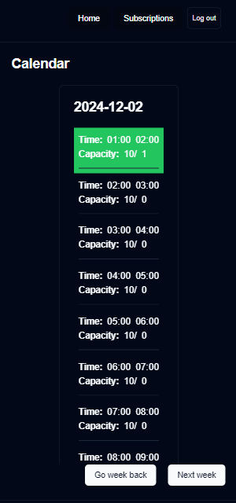

# monorepo
install pnpm https://pnpm.io/installation
```
pnpm install
```

# frontend
```
cd apps/next
pnpm run dev
```

# backend
```
cd apps/fastify-api
pnpm run dev
```
backend is running on http://localhost:3939

## DB and ORM

### when you change or add entity
```
npx mikro-orm-esm schema:drop --run
npx mikro-orm-esm schema:create --run
```
or 
```
# first check what gets generated
npx mikro-orm-esm schema:update --dump

# and when its fine, sync the schema
npx mikro-orm-esm schema:update --run
```

### Migrations 
not needed now

# DB
```
docker compose up postgres
```

# Docker
run whole stack:
```
docker compose up 
```

# Tech stack
### 1. [Nextjs](https://nextjs.org/) 
   - application frontend 
   - server side rendering
### 2. [ts-rest](https://ts-rest.com/) 
   - contract and schema between frontend and backend
   - validation and serialization
   - react hooks for api calls
   - state management
### 3. [Shadcn](https://ui.shadcn.com/) 
   - UI component library
### 4. [Fastify](https://fastify.dev/) 
   - application backend
### 5. [Mikro-orm](https://mikro-orm.io/) 
   - database ORM
### 6. [PostgreSQL](https://www.postgresql.org/) 
   - database
### 7. [PNPM](https://pnpm.io/) 
   - package manager
   - monorepo management

# Routes
- **/** - The home page where users can navigate to Register or Login  
  


- **/auth/login** - Login page for user authentication  
  


- **/auth/register** - Registration page for new users  
  


- **/user** - User dashboard to browse the calendar of planned schedules and join terms  
    
  


- **/user/sub** - Page for users to order a subscription

  


- **/admin** - Admin dashboard to view the calendar, terms

  


- **/admin/sub** - Admin page to review and manage pending subscriptions (approve/revoke)

  


- **/admin/createSchedule** - Admin page to plan schedules for upcoming weeks, set capacity, time intervals, and duration
  
  


# Endpoints

API base path is **/api/v1**

## User Endpoints (`/users`)

- **`GET /users`**
  - **Summary**: Get all users
  - **Responses**:
    - `200`: List of users (`z.array(zUserDto)`)
    - `400`: Error response (`zErrorDto`)
    - `401`: Unauthorized error (`zErrorDto`)


- **`GET /users/:id`**
  - **Summary**: Get a specific user by ID
  - **Responses**:
    - `200`: User data (`zUserDto`)
    - `400`: Error response (`zErrorDto`)
    - `401`: Unauthorized error (`zErrorDto`)
    - `404`: Not found error (`zErrorDto`)


- **`POST /users/register`**
  - **Summary**: Register a new user
  - **Request Body**: `zRegisterUserDto`
  - **Responses**:
    - `201`: Created user data (`zUserDto`)
    - `400`: Error response (`zErrorDto`)


- **`POST /users/login`**
  - **Summary**: Login a user
  - **Request Body**: `zLoginUserDto`
  - **Responses**:
    - `200`: Logged in user data (`zUserDto`)
    - `400`: Error response (`zErrorDto`)
    - `401`: Unauthorized error (`zErrorDto`)


- **`POST /users/logout`**
  - **Summary**: Logout a user
  - **Request Body**: None
  - **Responses**:
    - `200`: Success message (`z.string()`)
    - `400`: Error response (`zErrorDto`)
    - `401`: Unauthorized error (`zErrorDto`)


## Admin Schedule Endpoints (`/admin/schedules`)

- **`GET /admin/schedules`**
  - **Summary**: Get all schedules
  - **Responses**:
    - `200`: List of schedules (`zResponseScheduleDto.array()`)
    - `401`: Unauthorized error (`zErrorDto`)


- **`GET /admin/schedules/:id`**
  - **Summary**: Get a specific schedule by ID
  - **Responses**:
    - `200`: Schedule data (`zResponseScheduleDto`)
    - `401`: Unauthorized error (`zErrorDto`)
    - `404`: Not found error (`zErrorDto`)


- **`POST /admin/schedules`**
  - **Summary**: Create a new schedule
  - **Request Body**: `zRequestScheduleDto`
  - **Responses**:
    - `201`: Created schedule data (`zResponseScheduleDto`)
    - `400`: Error response (`zErrorDto`)
    - `401`: Unauthorized error (`zErrorDto`)
    - `404`: Not found error (`zErrorDto`)


- **`POST /admin/schedules/week`**
  - **Summary**: Create schedules for the week
  - **Request Body**: Array of `zRequestScheduleDto`
  - **Responses**:
    - `201`: Array of created schedules (`zResponseScheduleDto.array()`)
    - `400`: Error response (`zErrorDto`)
    - `401`: Unauthorized error (`zErrorDto`)
    - `404`: Not found error (`zErrorDto`)


- **`PUT /admin/schedules/:id`**
  - **Summary**: Update a specific schedule
  - **Request Body**: `zRequestScheduleDto`
  - **Responses**:
    - `200`: Updated schedule data (`zResponseScheduleDto`)
    - `400`: Error response (`zErrorDto`)
    - `401`: Unauthorized error (`zErrorDto`)
    - `404`: Not found error (`zErrorDto`)


- **`DELETE /admin/schedules/:id`**
  - **Summary**: Delete a specific schedule
  - **Responses**:
    - `204`: No content (successful deletion)
    - `400`: Error response (`zErrorDto`)
    - `401`: Unauthorized error (`zErrorDto`)
    - `404`: Not found error (`zErrorDto`)


## Admin Subscriptions Endpoints (`/admin/subscriptions`)

- **`GET /admin/subscriptions`**
  - **Summary**: Get all subscriptions
  - **Responses**:
    - `200`: List of subscriptions (`zResponseSubscriptionDto.array()`)
    - `400`: Error response (`zErrorDto`)
    - `401`: Unauthorized error (`zErrorDto`)


- **`GET /admin/subscriptions/:id`**
  - **Summary**: Get a specific subscription by ID
  - **Responses**:
    - `200`: Subscription data (`zResponseSubscriptionDto`)
    - `400`: Error response (`zErrorDto`)
    - `401`: Unauthorized error (`zErrorDto`)
    - `404`: Not found error (`zErrorDto`)


- **`POST /admin/subscriptions/approve/:id`**
  - **Summary**: Approve a subscription
  - **Request Body**: None
  - **Responses**:
    - `200`: Success message (`z.string()`)
    - `400`: Error response (`zErrorDto`)
    - `401`: Unauthorized error (`zErrorDto`)
    - `404`: Not found error (`zErrorDto`)


- **`POST /admin/subscriptions/revoke/:id`**
  - **Summary**: Revoke a subscription
  - **Request Body**: None
  - **Responses**:
    - `200`: Success message (`z.string()`)
    - `400`: Error response (`zErrorDto`)
    - `401`: Unauthorized error (`zErrorDto`)
    - `404`: Not found error (`zErrorDto`)


## Schedule Endpoints (`/schedules`)

- **`GET /schedules/:id`**
  - **Summary**: Get a specific schedule interval by ID
  - **Responses**:
    - `200`: Schedule interval data (`zResponseIntervalDto`)
    - `400`: Error response (`zErrorDto`)
    - `401`: Unauthorized error (`zErrorDto`)
    - `404`: Not found error (`zErrorDto`)


- **`GET /schedules/week/:day`**
  - **Summary**: Get the schedule for a specific day of the week
  - **Path Parameters**:
    - `day`: Date object (`z.coerce.date()`)
  - **Responses**:
    - `200`: List of schedules for the day (`zResponseScheduleDto.array()`)
    - `400`: Error response (`zErrorDto`)
    - `401`: Unauthorized error (`zErrorDto`)
    - `404`: Not found error (`zErrorDto`)


- **`POST /schedules/assign/:id`**
  - **Summary**: Assign a schedule to a user
  - **Request Body**: None
  - **Responses**:
    - `200`: Success message (`z.string()`)
    - `400`: Error response (`zErrorDto`)
    - `401`: Unauthorized error (`zErrorDto`)
    - `404`: Not found error (`zErrorDto`)


- **`POST /schedules/unassign/:id`**
  - **Summary**: Unassign a schedule from a user
  - **Request Body**: None
  - **Responses**:
    - `200`: Success message (`z.string()`)
    - `400`: Error response (`zErrorDto`)
    - `401`: Unauthorized error (`zErrorDto`)
    - `404`: Not found error (`zErrorDto`)


## Subscriptions Endpoints (`/subscriptions`)

- **`GET /subscriptions`**
  - **Summary**: Get subscriptions of the authenticated user
  - **Responses**:
    - `200`: List of subscriptions (`zResponseSubscriptionDto.array()`)
    - `400`: Error response (`zErrorDto`)
    - `401`: Unauthorized error (`zErrorDto`)


- **`POST /subscriptions/pay`**
  - **Summary**: Order and generate variable symbol for subscription payment
  - **Request Body**: Subscription order data (`zRequestSubscriptionDto`)
  - **Responses**:
    - `200`: Success message (`z.string()`)
    - `400`: Error response (`zErrorDto`)
    - `401`: Unauthorized error (`zErrorDto`)
